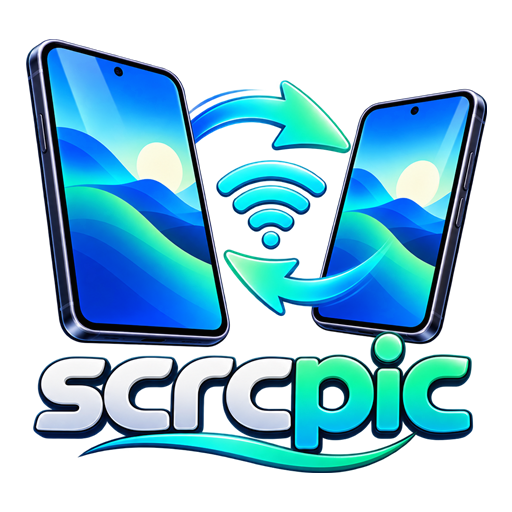

<p align="center">
  
</p>

<h1 align="center">Scrcpic</h1>

<p align="center">
  <b>High-Performance Android-to-Android Screen Mirroring & Remote Control Client</b><br/>
  <i>Control a broken phone, second device, or tablet directly from another Android phone over Wi-Fi or USB-C OTG cable — No PC or Root Required. Powered by Scrcpy v4.1.</i>
</p>

<p align="center">
  <a href="https://github.com/bayazidzaman/scrcpic/releases/latest">
    
  </a>
  <a href="https://github.com/bayazidzaman/scrcpic/releases/download/v1.1.0/Scrcpic-v1.1.0-release.apk">
    
  </a>
  
  
  
  
</p>

---

## 📑 Table of Contents
- [🌟 What is Scrcpic?](#-what-is-scrcpic)
- [🎯 Key Use Cases](#-key-use-cases)
- [✨ Features & Highlights](#-features--highlights)
- [📊 Comparison: Scrcpic vs Other Solutions](#-comparison-scrcpic-vs-other-solutions)
- [📱 Step-by-Step Connection Guide](#-step-by-step-connection-guide)
  - [Mode 1: Wireless Wi-Fi Connection](#mode-1-wireless-wi-fi-connection)
  - [Mode 2: Direct USB-C OTG Cable Link](#mode-2-direct-usb-c-otg-cable-link)
  - [Mode 3: Android 11+ Wireless Pairing Assistant](#mode-3-android-11-wireless-pairing-assistant)
- [⚙️ Streaming Presets & Performance](#️-streaming-presets--performance)
- [🛠️ Architecture & Technical Design](#️-architecture--technical-design)
- [❓ Frequently Asked Questions (FAQ)](#-frequently-asked-questions-faq)
- [🔧 Troubleshooting Common Issues](#-troubleshooting-common-issues)
- [📦 Building from Source](#-building-from-source)
- [🤝 Acknowledgments & Credits](#-acknowledgments--credits)
- [📄 License](#-license)

---

## 🌟 What is Scrcpic?

**Scrcpic** is an open-source, ultra-low-latency remote control client for Android devices based on the battle-tested **Scrcpy protocol (v4.1)**. 

If you are looking for **"scrcpy for mobile"** or a native **scrcpy Android client**, this is exactly what you need. While the official [scrcpy](https://github.com/Genymobile/scrcpy) project requires a desktop computer (Windows, macOS, or Linux) to act as the host client, **Scrcpic brings the entire scrcpy host pipeline directly into your Android smartphone**. 

With Scrcpic, an Android phone acts as the **master controller**, connecting to any target Android phone or tablet over local **Wi-Fi** (ADB TCP/IP) or a direct **USB-C to USB-C OTG cable**. It dynamically injects the lightweight `scrcpy-server` payload, decodes video frames locally using hardware `MediaCodec`, and renders a super-smooth 60 FPS video stream with interactive multi-touch gestures and remote hardware button controls.

**Key Highlights:**
- 🚫 **No PC Required:** True phone-to-phone screen mirroring anywhere, anytime.
- 🚫 **No Root Required:** Operates strictly within standard Android Debug Bridge (ADB) protocols.
- ⚡ **Near-Zero Latency:** Direct hardware decoding with sub-50ms wireless and sub-20ms wired latency.
- 🔒 **100% Local & Private:** No third-party cloud servers, no account registration, and no tracking.

---

## 🎯 Key Use Cases

| Use Case | Description |
| :--- | :--- |
| 🚑 **Control Broken Screen Phone** | Access files, retrieve 2FA authentication codes, copy WhatsApp messages, and backup data from an Android device with a shattered, unresponsive, or black touchscreen. |
| 🎮 **Remote Mobile Gaming** | Stream and play Android games from a secondary device onto a larger phone or tablet display at 60 FPS with full touch forwarding. |
| 🚗 **Car Dashboard & Media Rig** | Mirror a secondary phone used for GPS navigation or media streaming onto your primary phone or in-car Android tablet. |
| 🛠️ **Remote Support on the Go** | Troubleshoot an elderly relative’s or colleague's phone directly from your smartphone without carrying a laptop. |
| 🔌 **Offline Emergency OTG Link** | Plug a simple USB-C to USB-C cable between two phones in remote areas with zero Wi-Fi or cellular network required. |

---

## ✨ Features & Highlights

- ⚡ **Zero-Lag Hardware Video Pipeline:** Direct H.264 (AVC) and H.265 (HEVC) hardware decoding via Android's native `MediaCodec` and low-latency `SurfaceView`.
- 🎮 **Full Multi-Touch & Navigation Input:**
  - Forward single and multi-touch gestures (tap, swipe, pinch-to-zoom, scroll).
  - Dedicated virtual navigation controls: **Back**, **Home**, **App Switcher (Recents)**, **Power / Screen Wake**, and **Volume**.
- 🔄 **Rock-Solid Background Auto-Recovery (New in v1.1.0):**
  - Seamlessly handles app minimizing, multitasking, and screen lock events.
  - Automatically reconstructs the hardware decoder surface and triggers `ControlMessage.TYPE_RESET_VIDEO` to request an immediate IDR keyframe from the scrcpy server. No more frozen streams or black screens!
- 📐 **True Aspect Ratio & Orientation Lock (New in v1.1.0):**
  - Accurately renders remote displays with `Modifier.aspectRatio` without stretching, squashing, or letterboxing distortion.
  - Locked to portrait orientation by default to eliminate disorienting camera app rotations.
- 🧠 **Smart IP Address History Dropdown (New in v1.1.0):**
  - Automatically remembers previously connected device IP addresses and lets you select them instantly from an intelligent dropdown menu.
- 🔋 **Physical Display Off (Power Saver):**
  - Mirror and control the target phone while keeping its physical screen completely turned off, dramatically reducing battery drain and device heat.
- 🔌 **Dual Connection Architecture:**
  - **Wi-Fi Mode:** Connect to any phone over your local Wi-Fi network (Port 5555).
  - **USB OTG Mode:** Connect via direct USB-C to USB-C cable with automatic USB host detection and in-memory ADB bridging.
- 🤝 **Integrated Android 11+ Wireless Pairing Assistant:**
  - Enter the target device's 6-digit Wi-Fi pairing code and pairing port directly inside the app to authenticate without needing a computer.
- 🎨 **Modern Obsidian Dark UI:**
  - Built with Jetpack Compose & Material 3, featuring glassmorphism floating toolbars, live FPS counters, and customizable streaming presets.

---

## 📊 Comparison: Scrcpic vs Other Solutions

| Feature | Scrcpic (This App) | Official Scrcpy | TeamViewer / AnyDesk | RustDesk (Android) | ApowerMirror |
| :--- | :---: | :---: | :---: | :---: | :---: |
| **Android-to-Android Control** | ✅ **Yes (Native)** | ❌ No (PC Host only) | ⚠️ Cloud Relay Only | ⚠️ Limited Android Host | ⚠️ Paid / Cloud |
| **No PC Required** | ✅ **Yes** | ❌ Requires PC | ✅ Yes | ✅ Yes | ❌ Requires PC/Account |
| **No Root Required** | ✅ **Yes** | ✅ Yes | ⚠️ Requires Add-on | ⚠️ Accessibility hack | ⚠️ Requires Add-on |
| **Sub-50ms Latency** | ✅ **Yes (Direct)** | ✅ Yes (Direct) | ❌ High (150-300ms) | ❌ Variable | ❌ High |
| **USB-C OTG Cable Mode** | ✅ **Yes** | ❌ PC only | ❌ No | ❌ No | ❌ No |
| **100% Private (No Cloud)** | ✅ **Yes** | ✅ Yes | ❌ Cloud routed | ⚠️ Relay server | ❌ Cloud routed |
| **Completely Free & Open Source**| ✅ **Apache-2.0** | ✅ Apache-2.0 | ❌ Commercial / Limited | ✅ AGPL-3.0 | ❌ Subscription |

---

## 📱 Step-by-Step Connection Guide

### Mode 1: Wireless Wi-Fi Connection

1. **Prepare the Target Phone (the phone to control):**
   - Open **Settings** > **About Phone** and tap **Build Number** 7 times to enable Developer Options.
   - Go to **Settings** > **Developer Options** and enable **USB Debugging**.
   - If your device supports it, enable **Wireless Debugging** and note the IP address and port (e.g., `192.168.0.145:5555`).
   - *(Note: If Wireless Debugging isn't available, connect once via USB OTG or PC to execute `adb tcpip 5555`).*
2. **On the Controller Phone (running Scrcpic):**
   - Launch **Scrcpic** and select the **Wi-Fi** tab.
   - Choose your preferred streaming preset (e.g., *Ultra Low-Lag 720p @ 60fps*).
   - Select your target IP from the history dropdown or type it in.
   - Tap **Connect via Wi-Fi**.
   - When the authorization pop-up appears on the target phone, check **Always allow from this computer** and tap **Allow**.

### Mode 2: Direct USB-C OTG Cable Link

1. Connect both phones using a standard **USB-C to USB-C cable** (or USB OTG adapter).
2. Ensure **USB Debugging** is toggled ON in Developer Options on the target phone.
3. Open **Scrcpic** on the controller phone and select the **USB Cable** tab.
4. Tap **Connect via USB**. Grant the Android USB Host permission prompt when asked.
5. Scrcpic will establish a local high-speed ADB bridge and initiate the stream instantly with zero wireless packet loss!

### Mode 3: Android 11+ Wireless Pairing Assistant

1. On the target phone, navigate to **Settings** > **Developer Options** > **Wireless Debugging** > **Pair device with pairing code**.
2. Note the **6-digit pairing code**, **IP address**, and the dynamic **pairing port**.
3. In Scrcpic, tap the **Pair Device** button.
4. Input the IP, pairing port, and 6-digit code, then tap **Pair Device**.
5. Once pairing succeeds, tap **Connect Now** to begin mirroring immediately.

---

## ⚙️ Streaming Presets & Performance

Scrcpic offers three fine-tuned streaming presets designed for different hardware and network conditions:

| Preset | Resolution | Video Bitrate | Framerate | Average Latency | Recommended Scenario |
| :--- | :---: | :---: | :---: | :---: | :--- |
| ⚡ **Ultra Low-Lag** | 720p (1280px) | 8 Mbps | 60 FPS | **~15 - 35 ms** | Broken screen recovery, gaming, high-speed UI navigation |
| ⚖️ **Balanced** | 900p (1600px) | 12 Mbps | 60 FPS | **~35 - 50 ms** | General daily tasks, typing, social media, productivity |
| 💎 **High Fidelity**| 1080p (1920px) | 16 Mbps | 60 FPS | **~45 - 65 ms** | Reading fine text, code inspection, photo/video review |

---

## 🛠️ Architecture & Technical Design

```
┌──────────────────────────────────────┐                     ┌──────────────────────────────────────┐
│      Controller Phone (Scrcpic)      │                     │     Target Phone (Remote Device)     │
│                                      │                     │                                      │
│  ┌────────────────────────────────┐  │                     │  ┌────────────────────────────────┐  │
│  │   Jetpack Compose UI           │  │                     │  │        Android OS System       │  │
│  │   (MirrorScreen / Controls)    │  │                     │  │   (SurfaceFlinger / Display)   │  │
│  └───────────────┬────────────────┘  │                     │  └────────────────┬───────────────┘  │
│                  │ Touch / Keys      │                     │                   │ Screen Frame     │
│  ┌───────────────▼────────────────┐  │  ADB Control Socket │  ┌────────────────▼───────────────┐  │
│  │   ScrcpyController             ├──┼─────────────────────┼─►│   scrcpy-server.jar           │  │
│  │   (Binary Protocol Serializer) │  │   (Port 5555 / USB) │  │   (InputManager Injection)    │  │
│  └────────────────────────────────┘  │                     │  └────────────────┬───────────────┘  │
│                                      │                     │                   │ Raw Video Stream │
│  ┌────────────────────────────────┐  │  H.264 / H.265 NAL  │  ┌────────────────▼───────────────┐  │
│  │   VideoDecoder                 │◄─┼─────────────────────┼──┤   MediaCodec Hardware Encoder │  │
│  │   (Hardware MediaCodec Pipe)   │  │  Low-Latency Socket │  │   (Screen Capture Pipeline)   │  │
│  └───────────────┬────────────────┘  │                     │  └────────────────────────────────┘  │
│                  │ Direct Render     │                     │                                      │
│  ┌───────────────▼────────────────┐  │                     │                                      │
│  │   Hardware SurfaceView         │  │                     │                                      │
│  └────────────────────────────────┘  │                     │                                      │
└──────────────────────────────────────┘                     └──────────────────────────────────────┘
```

---

## ❓ Frequently Asked Questions (FAQ)

### Q1: Can I control an Android phone from another Android phone without a computer?
> **Yes!** That is the primary purpose of Scrcpic. Scrcpic executes the client role directly on Android, eliminating the requirement for a PC or external host.

### Q2: Can I use Scrcpic to recover data from a phone with a broken or shattered screen?
> **Yes.** As long as USB debugging is active, you can plug in via USB-C OTG cable or Wi-Fi, view the display in real-time, tap to unlock the phone, and transfer photos, contacts, 2FA credentials, or chat backups.

### Q3: Does Scrcpic require root access?
> **No.** Neither the controlling phone nor the target phone needs root. Scrcpic runs entirely using Android's built-in developer ADB protocol.

### Q4: Does Scrcpic work without an internet connection?
> **Yes.** Scrcpic operates 100% locally. In Wi-Fi mode, it connects over your local LAN router without touching the internet. In USB OTG cable mode, it requires neither Wi-Fi nor internet.

### Q5: How does Scrcpic prevent black screens when multitasking or locking the screen?
> Starting in **v1.1.0**, Scrcpic features a specialized lifecycle manager that safely recycles the hardware `MediaCodec` instance and transmits a `ControlMessage.TYPE_RESET_VIDEO` packet upon resume, compelling the server to produce an instantaneous IDR keyframe.

---

## 🔧 Troubleshooting Common Issues

- **"Device unauthorized" error:**
  - Unlock the target phone and look for the dialog asking: *"Allow USB debugging?"*. Check *"Always allow"* and tap **OK**.
- **Wi-Fi connection fails with "Connection refused":**
  - Verify that both devices are on the exact same Wi-Fi subnet.
  - Ensure ADB over TCP/IP is activated on port 5555 on the target device.
- **USB OTG device not recognized:**
  - Verify your cable supports data transfer (some budget cables are charge-only).
  - Make sure OTG is enabled in your phone's system settings (some brands like OnePlus, Oppo, Vivo have a manual "OTG Connection" toggle in Settings).

---

## 📦 Building from Source

### Prerequisites
- **Android Studio Ladybug (2024.2+)** or newer
- **JDK 17** or JDK 21
- **Android SDK Platform 35** / Build Tools 35.0.0

### Build Instructions
```bash
# Clone the repository
git clone https://github.com/bayazidzaman/scrcpic.git
cd scrcpic

# Compile and build the release APK
./gradlew assembleRelease

# The generated signed APK will be located at:
# app/build/outputs/apk/release/Scrcpic-v1.1.0-release.apk
```

---

## 🤝 Acknowledgments & Credits

- **[Genymobile / scrcpy](https://github.com/Genymobile/scrcpy)** by Romain Vimont — The gold standard for open-source Android screen mirroring.
- **[mobile-dev-inc / dadb](https://github.com/mobile-dev-inc/dadb)** — High-performance pure Kotlin ADB client.
- **[Jetpack Compose](https://developer.android.com/jetpack/compose)** — Android's modern declarative UI toolkit.

---

## 📄 License

This project is licensed under the **Apache License 2.0**. See the [LICENSE](LICENSE) file for terms and conditions.

<p align="center">
  <b>Made with ❤️ for the open-source Android community.</b>
</p>
